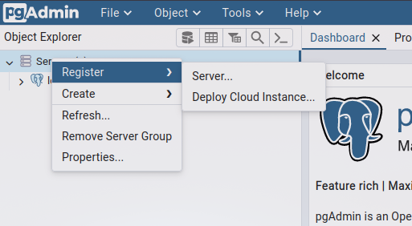
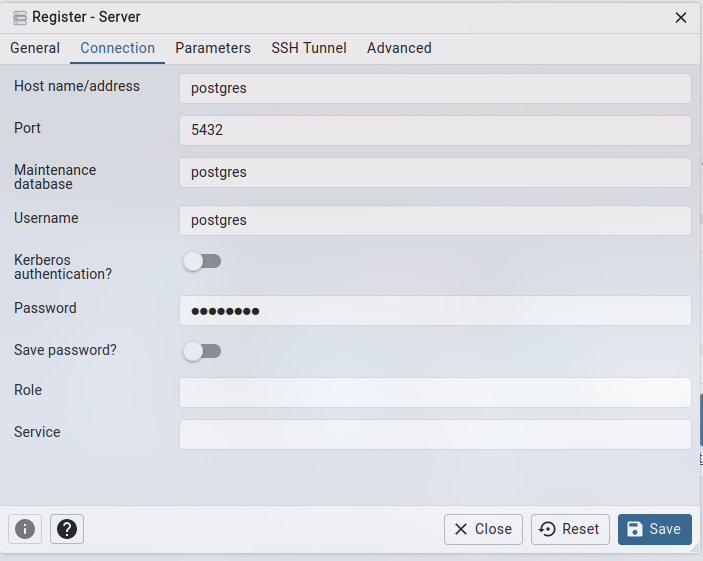
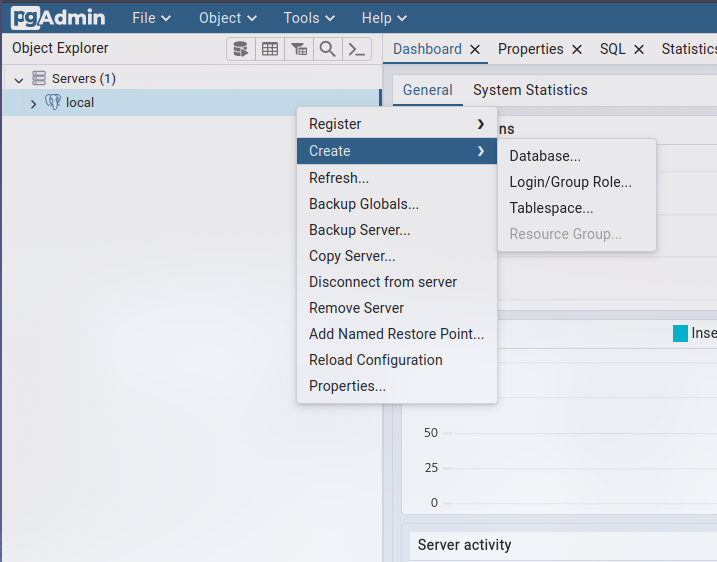
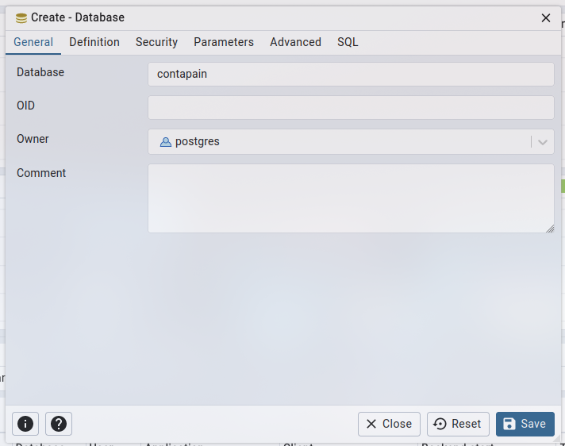
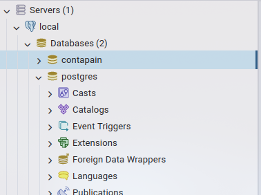

# Contapain T
___
## Configuration

Copy the .env.example file and paste it as .env

## Deployment

You can deploy easy with docker.

Just run:
```shell
docker compose up -d
```

you will se a bunch of containers running, just wait 5 seconds a go ahead to

=> [pgadmin](http://localhost:5050)

### Register the new server

There you will be prompted to set a password, set whatever password you want.

Now is time to create the database, go to servers, right click > Register > Server



Now Register the new server like the image below (give it whatever name that you want to call the server)



and click on save and you will see your new server added

### Create the database
Now you have to right click your new server (in this case I called local), and go to Create > Database...



Now register the new database as "contapain" (or whatever name you give in the .env file)



And thats its for creating the database



### Run the migrations

To run the migrations is easy with

```shell
docker exec -it contapain-app-app php artisan migrate:fresh --seed 
```

once the migration and the seed is done, you have to run the next command

```shell
docker exec -it contapain-app-app ./vendor/bin/phpunit tests/Feature/insertarCatalogoTest.php
```

and thats all you can go ahead to visit contapain in your local env

http://localhost:8000

just create an account and you are good to go!
